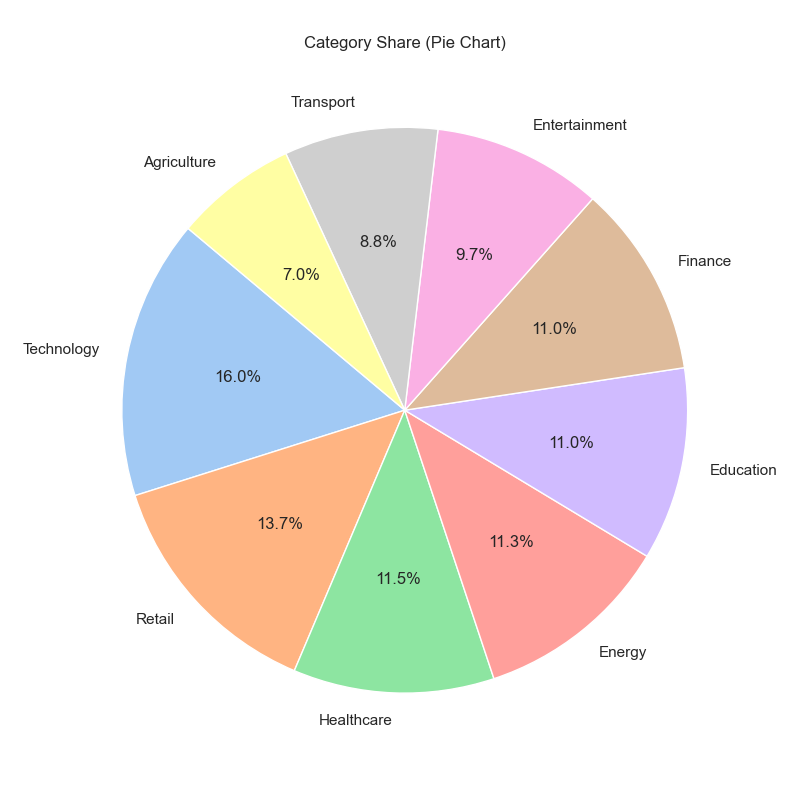

## Task2 - Visuallization 

### 1) Create a git hub repo

### 2) Create venv :
> uv venv \
> .venv\Scripts\activate

### 3) connect local repo to remote repo:
> git init \
> git remote add origin https://github.com/janamalki/ds_task2.git \
> git add . \
> git commit -m "initial commit" 

### 4) install libraries :
> uv pip install pandas matplotlib seaborn 

### 5) create file for .gitignore : 
>git add . \
>git commit -m "add .gitignore" \
> git push

### 6) visuliize data (Put data file and code in ds_task2 folder):
> git add . \
> git commit -m "add files" \
> git push

### Result :
#### bar_chart_category

#### grouped_bar_chart

#### pie_chart_category

